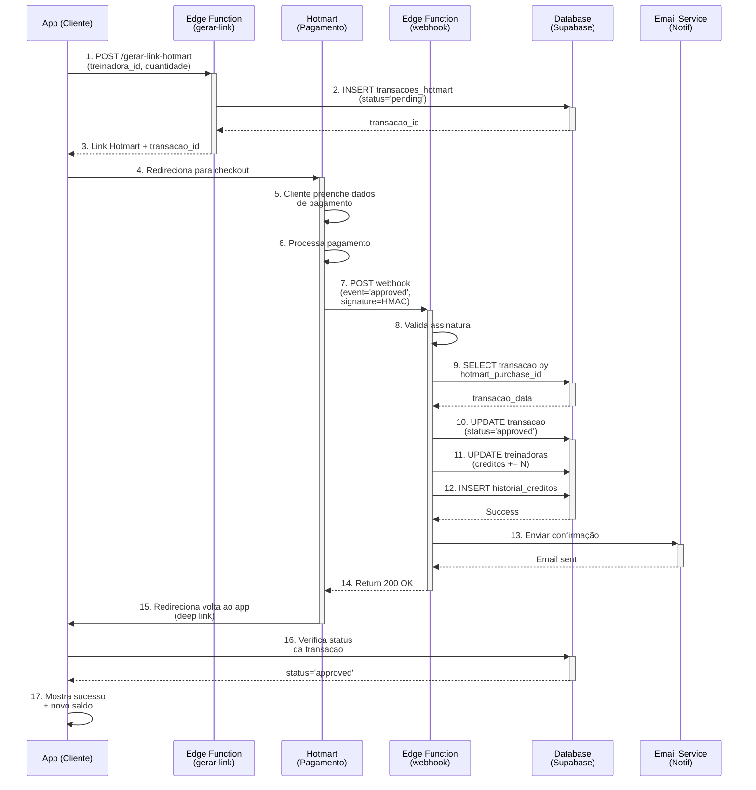
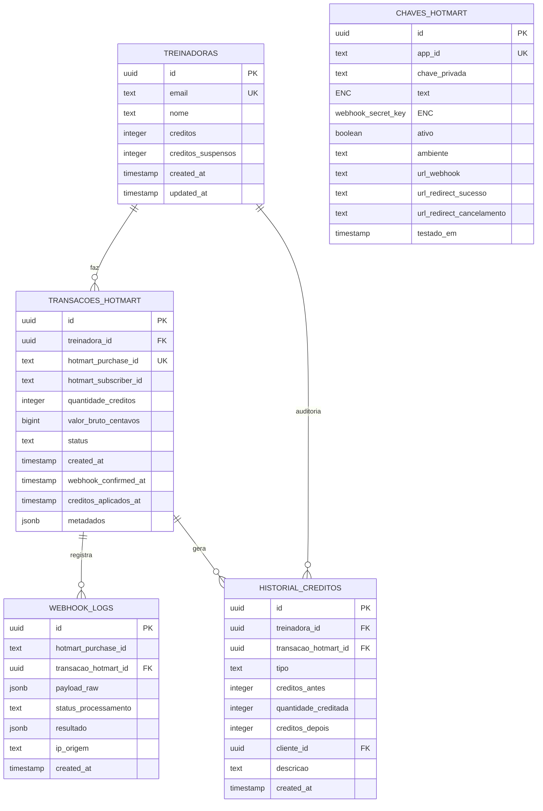
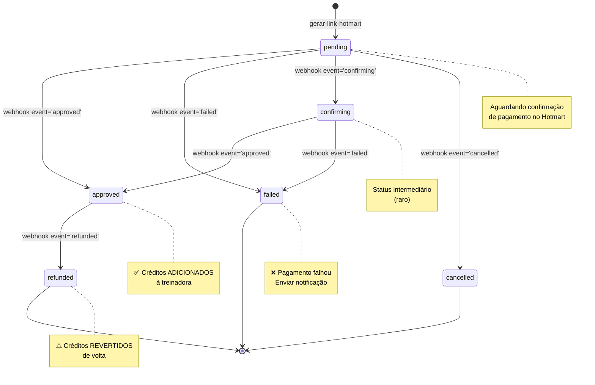
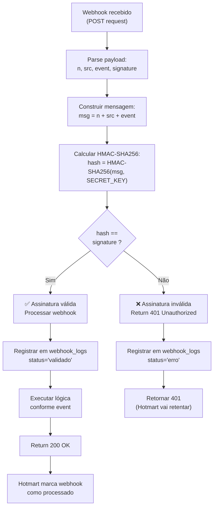
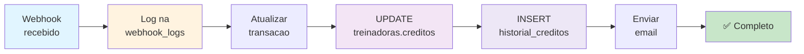
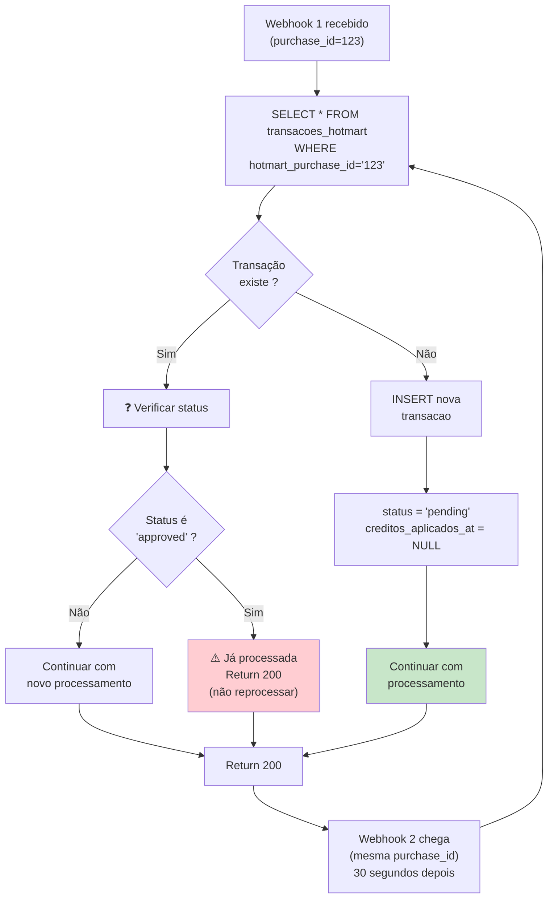
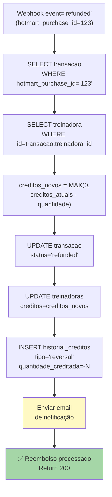
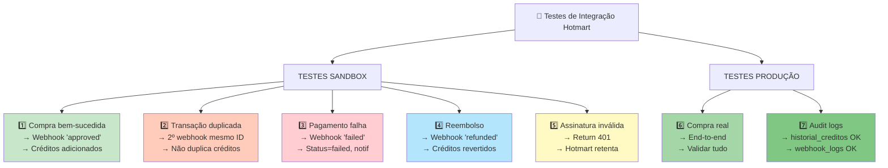
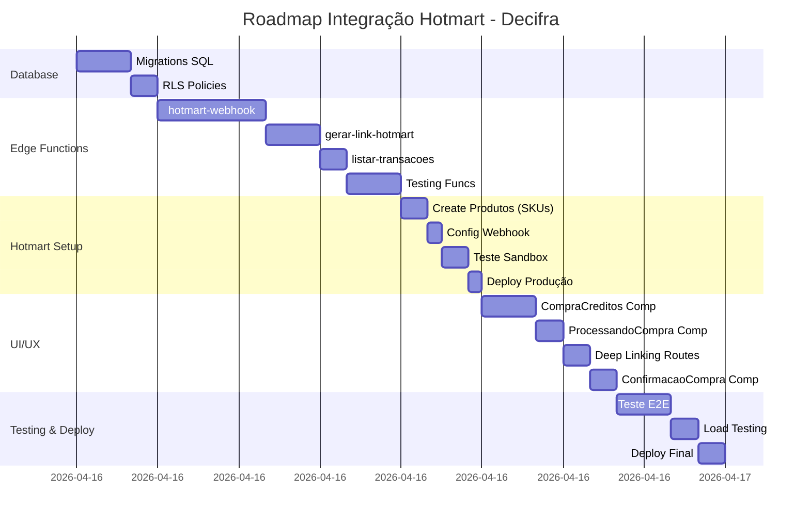

# 🔄 DIAGRAMA: FLUXO DE INTEGRAÇÃO HOTMART

## 1. FLUXO COMPLETO DE COMPRA



## 2. ARQUITETURA DE BANCO DE DADOS



## 3. MÁQUINA DE ESTADOS (Transações)



## 4. ESTRUTURA DE DIRETÓRIOS - EDGE FUNCTIONS

```
supabase/functions/
│
├── hotmart-webhook/
│   ├── index.ts (600 linhas)
│   │   ├── CORS headers
│   │   ├── Parse form-encoded data (Hotmart)
│   │   ├── Validar assinatura HMAC
│   │   ├── Switch por event (approved/failed/refunded/cancelled)
│   │   ├── processarAprovacao() - UPDATE creditos
│   │   ├── processarFalha()
│   │   ├── processarReembolso()
│   │   └── RLS: Read from transacoes, Insert webhook_logs
│   │
│   └── validar-assinatura.ts (COMPARTILHADO)
│       └── função validarAssinatura(payload, secret): string
│
├── gerar-link-hotmart/
│   └── index.ts (300 linhas)
│       ├── Validar treinadora_id + quantidadeCreditos
│       ├── Mapear quantidade → preço (tabela)
│       ├── INSERT em transacoes_hotmart (status=pending)
│       ├── Gerar URL Hotmart checkout
│       └── Retornar {linkHotmart, transacao_id, valor}
│
├── listar-transacoes/
│   └── index.ts (150 linhas)
│       ├── GET /listar-transacoes?treinadora_id=xxx
│       ├── SELECT transacoes_hotmart
│       ├── RLS: Treinadora vê apenas suas
│       └── Retornar array de transações
│
└── [Functions existentes]
    ├── cadastrar-cliente/
    ├── enviar-codigo-email/
    └── ...
```

## 5. VALIDAÇÃO DE ASSINATURA - FLUXO CRITÉRIO



## 6. CICLO DE RECONCILIAÇÃO



## 7. PROTEÇÃO CONTRA DUPLICAÇÃO (Idempotência)



## 8. FLUXO REVERSAL - REEMBOLSO



## 9. PLANO DE TESTES



## 10. Roadmap Gantt (Timeline)



---

**Legenda**:
- 🔐 Encriptado em repouso
- 📝 Auditado/Logged
- ✅ Idempotente
- 🔄 Reversível
- ⚡ Async
